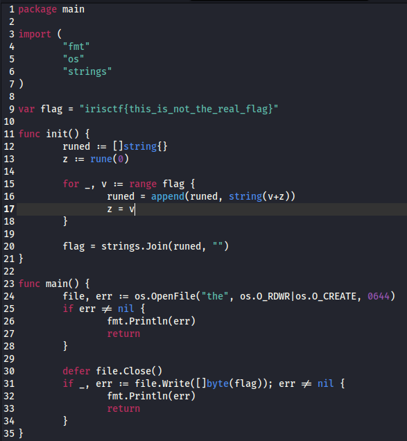
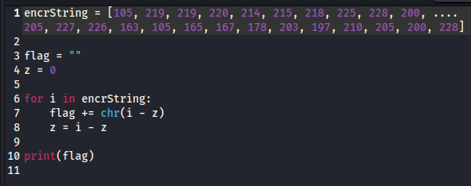

<!DOCTYPE html>
<html>
<head>
    
</head>
<body>
    <h1>Rune? What’s that?- irisctf 2024 Challenge Writeup</h1>

    <h2>Challenge Description</h2>
    
Rune? Like the ancient alphabet?

    <h2>Solution Approach</h2>
    
Here are the steps we took to solve the challenge:

    <ol>
  To answer the question from the prompt, the rune function in Golang converts characters to their decimal representation. This knowledge will help us solve this challenge.

Two files are provided to the competitor, a script written in Golang and a text file titled ‘the’ that has the encoded flag string in.

Figure 8. The Golang Script
The encoding logic occurs in the init function at line 15 of the script in Figure 8. The script will cycle through each character of the flag string, variable v, and add its value to variable z, intialized as 0 at line 13, to produce the new encoded character. Then, z is replaced by v before repeating the loop. This means each new character is added to the one before it.

To reverse this encoding process simply subtract ‘z’ instead of adding it each character. Doing so will provide you with the decoded flag. The Python script I used to decode the string can be seen in Figure 9 with part of the encoded string already converted to its decimal representation.

       
    
    </ol>
 
    <h2>Flag</h2>
    
flag{}

    <h2>Conclusion</h2>
    
this is a very   easy chanllenge for work on develper tools in in chrome and web exploitations

</body>
</html>
